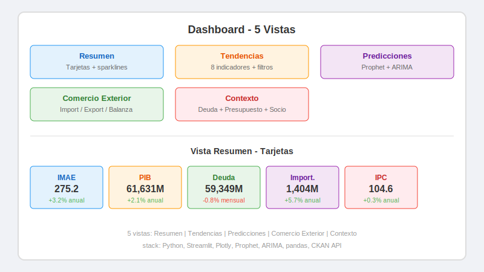

# Dashboard de Indicadores Economicos de Panama con IA

**Grupo 2 — 1GS242 — Topicos Especiales**
**Profesor:** Reinel Aguirre — **I Semestre 2026 — UTP**

**Integrantes:** Cesar Santiago, Jean Suarez, Diego Vina, Simon Espino

**Repositorio:** [github.com/aaacmsg/topicos_parcial2](https://github.com/aaacmsg/topicos_parcial2)

---

## Pipeline del Proyecto




---

## Resumen

Dashboard interactivo que integra datos economicos publicos de Panama desde el portal
[datosabiertos.gob.pa](https://datosabiertos.gob.pa) del Gobierno de Panama via **CKAN API**,
aplica modelos predictivos de series temporales sobre el IMAE (Prophet) y el PIB (ARIMA),
y visualiza los resultados en un dashboard construido con Streamlit.

**11 datasets** del INEC, Ministerio de Economia y Finanzas (MEF), Contraloria General
y Superintendencia de Bancos de Panama (SBP), que abarcan desde 2003 hasta 2026.

---

## Key Features

- **Pipeline inteligente** — descarga solo datos nuevos comparando `last_modified` de CKAN contra archivos locales
- **11 indicadores macroeconomicos** — IMAE, PIB, IPC, importaciones, exportaciones, balanza de pagos, deuda publica, ejecucion presupuestaria y sociodemograficos
- **2 modelos predictivos** — Prophet para IMAE (12 meses), SARIMA para PIB (4 trimestres)
- **Dashboard de 5 vistas** — Resumen, Tendencias, Predicciones, Comercio Exterior, Contexto
- **Totalmente replicable** — `python run.py` auto-detecta el entorno virtual y ejecuta todo
- **Codigo abierto** — repositorio publico con tests, documentacion y datos de muestra

---

## Fuentes de Datos

### Portal CKAN

Todos los datos se obtienen del portal de datos abiertos del Gobierno de Panama:
[datosabiertos.gob.pa](https://datosabiertos.gob.pa), que implementa el estandar
**CKAN** (Comprehensive Knowledge Archive Network). CKAN expone una API REST
que permite buscar, descubrir y descargar datasets programaticamente.

**Mecanismo de consumo:**

1. `GET /api/3/action/package_search?q={query}` — busca datasets por palabra clave
2. `GET /api/3/action/resource_show?id={resource_id}` — obtiene metadatos del recurso (`last_modified`, `url`)
3. `GET {url}` — descarga el CSV directamente

Cada dataset tiene un `resource_id` fijo en la configuracion, y el pipeline
compara la fecha `last_modified` del recurso contra la fecha de modificacion
del archivo local para decidir si debe redescargarlo.

### Datasets

| Dataset | Organismo | Periodo | Frecuencia | Ultima actualizacion |
|---------|-----------|---------|------------|---------------------|
| IMAE — Indice Mensual de Actividad Economica | INEC | 2016 - 2026 | Mensual | 2026-03-27 |
| PIB Trimestral (precios constantes) | INEC | 2018 - 2025 | Trimestral | 2026-03-05 |
| PIB Trimestral (precios corrientes) | INEC | 2018 - 2025 | Trimestral | 2026-03-05 |
| Importaciones — Valor CIF | INEC | 2003 - 2025 | Mensual | 2025-12-22 |
| Importaciones — Peso Neto | INEC | 2003 - 2025 | Mensual | 2025-12-22 |
| Exportaciones por pais de destino | INEC | 2000 - 2019 | Anual | 2020-10-07 |
| Balanza de Pagos | INEC | 2024 - 2025 | Semestral | 2025-11-25 |
| IPC — Indice de Precios al Consumidor | INEC | 2019 | Mensual | 2020-10-02 |
| Deuda Publica del sector publico | MEF | 2025 | Mensual | 2026-03-25 |
| Ejecucion Presupuestaria de gastos | Contraloria | 2026 | Anual | 2026-02-24 |
| Indicadores Sociodemograficos | INEC | 2013 - 2020 | Anual | 2020-10-05 |

---

## Modelos ML

### Prophet (IMAE)

**Que es Prophet:** Modelo de series temporales desarrollado por Meta (Facebook) en 2017.
Descompone automaticamente la serie en tres componentes: tendencia, estacionalidad anual
y efectos de dias festivos/eventos especiales. Es robusto ante outliers y datos faltantes.

**Aplicacion:** Se entreno con 121 observaciones mensuales del IMAE (2016 - 2026).
Predice el IMAE para los proximos 12 meses con intervalos de confianza al 80%.

**Libreria:** `prophet` (antes `fbprophet`)

### SARIMA (PIB)

**Que es SARIMA:** Modelo estadistico clasico (Seasonal AutoRegressive Integrated Moving
Average). Captura autocorrelaciones, tendencias y estacionalidad en series temporales.
El orden optimo (p,d,q) se selecciona automaticamente mediante busqueda por AIC.

**Aplicacion:** Se entrena con datos trimestrales del PIB real (2018 - 2025).
Predice el PIB para los proximos 4 trimestres con intervalos de confianza al 80%.

**Libreria:** `statsmodels` — `SARIMAX`

---

## Pipeline

```
┌──────────────────┐     ┌──────────────────┐     ┌──────────────────┐     ┌──────────────────┐
│   INGESTA        │  →  │ PREPROCESAMIENTO  │  →  │   MODELOS ML     │  →  │   DASHBOARD      │
│                  │     │                   │     │                  │     │                  │
│ CKAN API (REST)  │     │ Limpieza          │     │ Prophet (IMAE)   │     │ Streamlit        │
│ requests + csv   │     │ Encoding detect   │     │ ARIMA (PIB)      │     │ Plotly           │
│ pandas read_csv  │     │ Estandarizar      │     │ Evaluacion       │     │ 5 vistas         │
│ chardet encoding │     │ Feature eng       │     │ Metricas         │     │ Interactivo      │
└──────┬───────────┘     └──────┬────────────┘     └──────┬───────────┘     └──────┬───────────┘
       │                        │                         │                        │
       ▼                        ▼                         ▼                        ▼
   data/raw/*.csv       data/processed/*.parquet     data/models/*.{json,pkl}   localhost:8501
```

### Etapa 1: Ingesta

`src/ingest/ckan_client.py` implementa un cliente HTTP para la API CKAN.
`src/ingest/datasets_config.py` contiene la configuracion de 11 datasets
con sus `resource_id` fijos. El cliente:

1. Consulta `resource_show` para obtener `last_modified`
2. Compara con la fecha de modificacion del archivo local
3. Si el archivo local esta desactualizado o no existe, descarga el CSV
4. Detecta automaticamente el encoding (chardet) y el separador (`,` o `;`)

### Etapa 2: Preprocesamiento

`src/preprocessing/pipeline.py` transforma los CSVs crudos en Parquets listos para ML:

- **Encoding**: deteccion automatica con fallback a latin-1/cp1252
- **Columnas**: estandarizacion de nombres (snake_case, sin acentos), eliminacion de columnas `Unnamed`
- **Fechas**: parseo de formatos variados (`16-ene`, `Enero 2019`, `2018-Q1`)
- **Unpivot**: conversion de formato ancho a largo (exportaciones por pais, PIB por actividad)
- **Feature engineering**: variacion interanual, variacion mensual y media movil 12 meses

### Etapa 3: Modelos

`src/models/prophet_model.py` y `src/models/arima_model.py` implementan
el entrenamiento, serializacion y prediccion de ambos modelos. Los modelos
entrenados se guardan en `data/models/` y se cargan en el dashboard.

### Etapa 4: Dashboard

`src/dashboard/` contiene 5 componentes independientes que se cargan
como paginas en la app de Streamlit.

---

## Librerias Principales

| Libreria | Version | Proposito |
|----------|---------|-----------|
| `requests` | >=2.31 | Cliente HTTP para CKAN API |
| `pandas` | >=2.0 | DataFrames, lectura CSV, manipulacion |
| `pyarrow` | >=12.0 | Formato Parquet (almacenamiento columnar) |
| `chardet` | >=7.0 | Deteccion de encoding de archivos |
| `prophet` | >=1.1 | Modelo de series temporales (Meta) |
| `statsmodels` | >=0.14 | Modelo SARIMA (ARIMA estacional) |
| `scikit-learn` | >=1.3 | Metricas de evaluacion (opcional) |
| `streamlit` | >=1.28 | Framework de dashboards web |
| `plotly` | >=5.17 | Graficos interactivos |
| `pytest` | >=7.4 | Tests unitarios |

---

## Dashboard (5 vistas)

| Vista | Componente | Descripcion |
|-------|-----------|-------------|
| **Resumen** | `overview.py` | 5 tarjetas con valor actual, variacion anual, sparkline y fuente (INEC/MEF). Tabla inferior con los 9 indicadores, su ultimo valor y periodo. |
| **Tendencias** | `trends.py` | 8 indicadores seleccionables. Grafico Plotly interactivo con zoom, rango de fechas ajustable, toggle de variacion interanual y media movil 12m. Stats box con ultimo, promedio, minimo y maximo. |
| **Predicciones** | `predictions.py` | Seleccion IMAE (Prophet) o PIB (ARIMA). Grafico historico + forecast + banda de confianza 80%. Tabla del pronostico. Descarga CSV. Explicacion del modelo en expander. |
| **Comercio Exterior** | `trade.py` | 3 tabs: importaciones valor, importaciones peso, exportaciones. Graficos por tipo de bien. Top 10 paises de destino. Tabla completa expandible. |
| **Contexto** | `context.py` | 3 tabs: deuda publica (MEF, agrupada por mes), ejecucion presupuestaria (Contraloria), indicadores sociodemograficos (INEC) con selectores en espanol. |

---

## Estructura del Proyecto

```
├── assets/                     # Diagramas e imagenes
├── data/
│   ├── raw/                    # CSVs descargados desde CKAN
│   ├── processed/              # Parquets limpios (preprocessing)
│   └── models/                 # Modelos serializados (prophet, arima)
├── src/
│   ├── ingest/
│   │   ├── ckan_client.py      # Cliente CKAN API
│   │   ├── datasets_config.py  # Config con resource_ids
│   │   └── run_ingest.py       # Script de descarga
│   ├── preprocessing/
│   │   ├── pipeline.py         # Limpieza y transformacion
│   │   ├── features.py         # Feature engineering
│   │   ├── datasets_prep_config.py
│   │   └── run_preprocessing.py
│   ├── models/
│   │   ├── prophet_model.py    # Prediccion IMAE
│   │   ├── arima_model.py      # Prediccion PIB
│   │   └── evaluator.py        # Metricas RMSE, MAE, MAPE
│   └── dashboard/
│       ├── app.py              # Entry point Streamlit
│       ├── data_utils.py       # Helpers compartidos
│       └── components/
│           ├── overview.py     # Vista Resumen
│           ├── trends.py       # Vista Tendencias
│           ├── predictions.py  # Vista Predicciones
│           ├── trade.py        # Vista Comercio Exterior
│           └── context.py      # Vista Contexto
├── tests/
│   ├── test_ingest.py          # 8 tests de ingesta
│   └── test_preprocessing.py   # 18 tests de preprocesamiento
├── run.py                      # Entry point unico
├── requirements.txt
└── README.md
```

---

## Instalacion

```bash
git clone https://github.com/aaacmsg/topicos_parcial2.git
cd topicos_parcial2

python -m venv .venv
.venv\Scripts\pip install -r requirements.txt    # Windows
# .venv/bin/pip install -r requirements.txt      # Mac / Linux
```

## Ejecucion

```bash
python run.py
```

`run.py` auto-detecta el entorno virtual, descarga solo datos nuevos, preprocesa,
entrena modelos y abre el dashboard en `http://localhost:8501`.

### Comandos

| Comando | Efecto |
|---------|--------|
| `python run.py` | Pipeline completo + dashboard |
| `python run.py --dashboard` | Solo abrir dashboard |
| `python run.py --ingest` | Solo descargar (inteligente) |
| `python run.py --force` | Forzar redescarga total |
| `python run.py --ingest --force` | Forzar solo descarga |
| `python run.py --preprocess` | Solo preprocesar |
| `python run.py --train` | Solo entrenar modelos |
| `python run.py --skip-download` | Pipeline sin descargar |

---

## Tests

```bash
python -m pytest tests/ -v
```

26 tests unitarios que cubren el cliente CKAN, deteccion de encoding,
parseo de fechas, feature engineering y el pipeline completo de limpieza.

---

**Universidad Tecnologica de Panama — Facultad de Ingenieria de Sistemas Computacionales**
**Topicos Especiales — I Semestre 2026**
