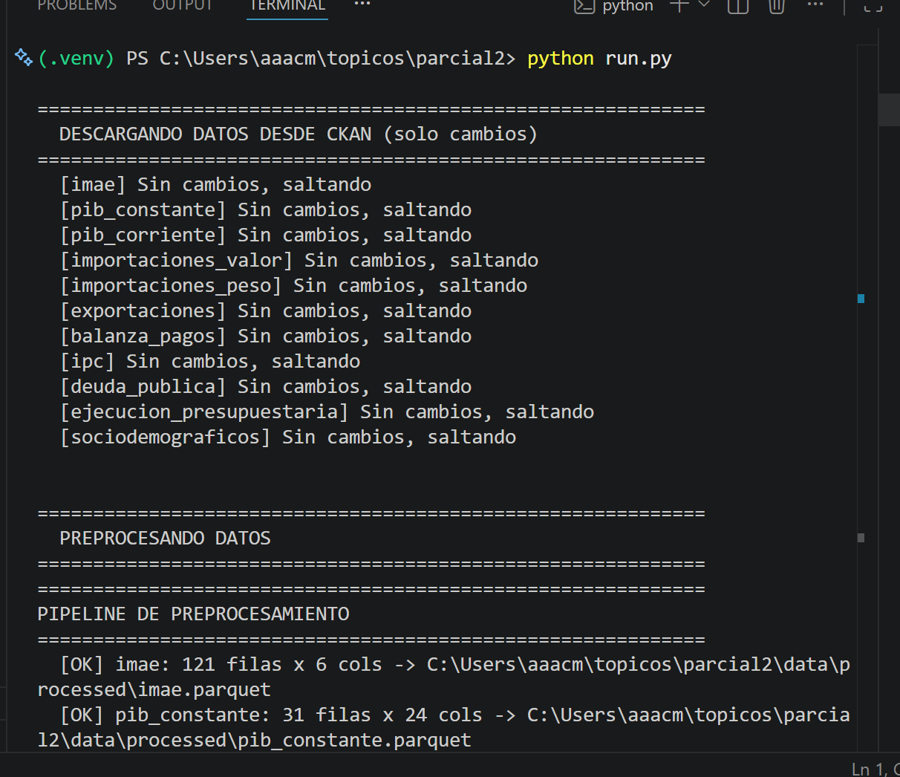
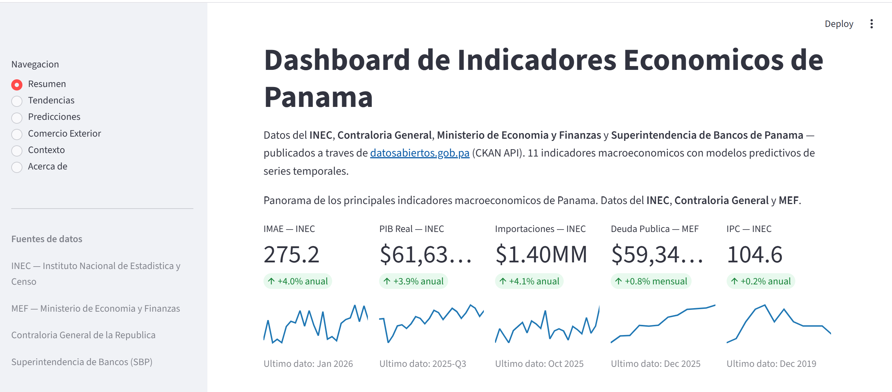

# Dashboard de Indicadores Economicos de Panama con IA

**Grupo 2 — 1GS242 — Topicos Especiales**
**Profesor:** Reinel Aguirre — **I Semestre 2026 — UTP**

**Integrantes:** Cesar Santiago, Jean Suarez, Diego Vina, Simon Espino

**Repositorio:** [github.com/aaacmsg/topicos_parcial2](https://github.com/aaacmsg/topicos_parcial2)

---

## Pipeline del Proyecto




---

## Dashboard




---

## Resumen

Dashboard interactivo que integra datos economicos publicos de Panama desde el portal
[datosabiertos.gob.pa](https://datosabiertos.gob.pa) del Gobierno de Panama via **CKAN API**,
aplica modelos predictivos de series temporales sobre el IMAE (Prophet) y el PIB (ARIMA),
y visualiza los resultados en un dashboard construido con Streamlit.

**11 datasets** del INEC, Ministerio de Economia y Finanzas (MEF), Contraloria General
y Superintendencia de Bancos de Panama (SBP), que abarcan desde 2003 hasta 2026.

---

## Key Features

- **Pipeline inteligente** — descarga solo datos nuevos comparando `last_modified` de CKAN contra archivos locales
- **11 indicadores macroeconomicos** — IMAE, PIB, IPC, importaciones, exportaciones, balanza de pagos, deuda publica, ejecucion presupuestaria y sociodemograficos
- **2 modelos predictivos** — Prophet para IMAE (12 meses), SARIMA para PIB (4 trimestres)
- **Dashboard de 5 vistas** — Resumen, Tendencias, Predicciones, Comercio Exterior, Contexto
- **Totalmente replicable** — `python run.py` auto-detecta el entorno virtual y ejecuta todo
- **Codigo abierto** — repositorio publico con tests, documentacion y datos de muestra

---

## Uso del Dashboard

### Vista Resumen

Presenta 5 tarjetas con los indicadores macroeconomicos principales:
**IMAE**, **PIB**, **Importaciones**, **Deuda Publica** e **IPC**.

Cada tarjeta muestra:
- **Valor actual** del indicador con formato segun su unidad (indice, USD, millones USD)
- **Variacion porcentual** respecto al periodo anterior (anual o mensual)
- **Sparkline** con la tendencia de los ultimos 24 periodos
- **Fuente** del dato (INEC, MEF)
- **Ultimo periodo** disponible (Ene 2026, Dic 2025, etc.)

Debajo de las tarjetas hay una tabla con todos los datasets disponibles,
su ultimo valor registrado y el periodo correspondiente.

### Vista Tendencias

Selector con **8 indicadores** para explorar su evolucion historica:

- **IMAE (Actividad Economica)** — serie mensual 2016-2026
- **PIB Real / Corriente** — PIB trimestral por actividad
- **Importaciones (Valor / Peso)** — desglose por tipo de bien
- **IPC (Inflacion)** — precio al consumidor
- **Deuda Publica** — saldo mensual consolidado del MEF
- **Balanza de Pagos** — cuenta corriente

**Controles:**
- **Rango de fechas:** slider ajustable para acercar/alejar el periodo
- **Variacion interanual:** toggle que convierte la serie a variacion % vs 12 meses atras
- **Media movil 12m:** toggle que superpone una linea suavizada

**Stats box:** Muestra ultimo valor, promedio, minimo y maximo del periodo seleccionado.

### Vista Predicciones

Dos modelos seleccionables:

| Modelo | Indicador | Horizonte | Interpretacion |
|--------|-----------|-----------|----------------|
| **Prophet** | IMAE | 12 meses | La linea naranja es el valor estimado. El area sombreada es el intervalo de confianza al 80%. Si la banda es angosta, hay mayor certeza. |
| **SARIMA** | PIB Real | 4 trimestres | Similar al Prophet. El orden optimo (p,d,q) se selecciona automaticamente. |

**Botones:**
- **Re-entrenar modelo:** Vuelve a entrenar con los datos mas recientes (util si se ejecuto `--force`)
- **Descargar CSV:** Exporta la tabla del pronostico

**Que significa el intervalo de confianza:** Si el IMAE estimado para Enero 2027 es 285 ± 15,
significa que hay un 80% de probabilidad de que el valor real este entre 270 y 300.

### Vista Comercio Exterior

Tres tabs:

| Tab | Datos | Periodo |
|-----|-------|---------|
| **Importaciones (Valor)** | Valor CIF en USD por tipo (consumo, intermedio, capital) | 2003 - 2025 |
| **Importaciones (Peso)** | Peso neto en Kg por tipo | 2003 - 2025 |
| **Exportaciones** | Top 10 paises de destino con valores en USD millones | 2000 - 2019 |

Incluye tabla expandible con todos los paises ordenados por valor exportado.

### Vista Contexto

Tres tabs con datos complementarios:

| Tab | Fuente | Datos |
|-----|--------|-------|
| **Deuda Publica** | MEF | Evolucion mensual del saldo total consolidado (todos los organismos). 12 meses con tendencia. |
| **Ejecucion Presupuestaria** | Contraloria General | Gasto del gobierno central. |
| **Sociodemograficos** | INEC | Selector con indicadores en espanol: densidad poblacional, natalidad, mortalidad, esperanza de vida, educacion, salud. |

---

## Fuentes de Datos

### Portal CKAN

Todos los datos se obtienen del portal de datos abiertos del Gobierno de Panama:
[datosabiertos.gob.pa](https://datosabiertos.gob.pa), que implementa el estandar
**CKAN** (Comprehensive Knowledge Archive Network). CKAN expone una API REST
que permite buscar, descubrir y descargar datasets programaticamente.

**Mecanismo de consumo:**

1. `GET /api/3/action/package_search?q={query}` — busca datasets por palabra clave
2. `GET /api/3/action/resource_show?id={resource_id}` — obtiene metadatos del recurso (`last_modified`, `url`)
3. `GET {url}` — descarga el CSV directamente

Cada dataset tiene un `resource_id` fijo en la configuracion, y el pipeline
compara la fecha `last_modified` del recurso contra la fecha de modificacion
del archivo local para decidir si debe redescargarlo.

### Datasets

| Dataset | Organismo | Periodo | Frecuencia | Ultima actualizacion |
|---------|-----------|---------|------------|---------------------|
| IMAE — Indice Mensual de Actividad Economica | INEC | 2016 - 2026 | Mensual | 2026-03-27 |
| PIB Trimestral (precios constantes) | INEC | 2018 - 2025 | Trimestral | 2026-03-05 |
| PIB Trimestral (precios corrientes) | INEC | 2018 - 2025 | Trimestral | 2026-03-05 |
| Importaciones — Valor CIF | INEC | 2003 - 2025 | Mensual | 2025-12-22 |
| Importaciones — Peso Neto | INEC | 2003 - 2025 | Mensual | 2025-12-22 |
| Exportaciones por pais de destino | INEC | 2000 - 2019 | Anual | 2020-10-07 |
| Balanza de Pagos | INEC | 2024 - 2025 | Semestral | 2025-11-25 |
| IPC — Indice de Precios al Consumidor | INEC | 2019 | Mensual | 2020-10-02 |
| Deuda Publica del sector publico | MEF | 2025 | Mensual | 2026-03-25 |
| Ejecucion Presupuestaria de gastos | Contraloria | 2026 | Anual | 2026-02-24 |
| Indicadores Sociodemograficos | INEC | 2013 - 2020 | Anual | 2020-10-05 |

---

## Modelos ML

### Prophet (IMAE)

**Que es Prophet:** Modelo de series temporales desarrollado por Meta (Facebook) en 2017.
Descompone automaticamente la serie en tres componentes: tendencia, estacionalidad anual
y efectos de dias festivos/eventos especiales. Es robusto ante outliers y datos faltantes.

**Aplicacion:** Se entreno con 121 observaciones mensuales del IMAE (2016 - 2026).
Predice el IMAE para los proximos 12 meses con intervalos de confianza al 80%.

**Libreria:** `prophet` (antes `fbprophet`)

### SARIMA (PIB)

**Que es SARIMA:** Modelo estadistico clasico (Seasonal AutoRegressive Integrated Moving
Average). Captura autocorrelaciones, tendencias y estacionalidad en series temporales.
El orden optimo (p,d,q) se selecciona automaticamente mediante busqueda por AIC.

**Aplicacion:** Se entrena con datos trimestrales del PIB real (2018 - 2025).
Predice el PIB para los proximos 4 trimestres con intervalos de confianza al 80%.

**Libreria:** `statsmodels` — `SARIMAX`

---

## Pipeline

```
┌──────────────────┐     ┌──────────────────┐     ┌──────────────────┐     ┌──────────────────┐
│   INGESTA        │  →  │ PREPROCESAMIENTO  │  →  │   MODELOS ML     │  →  │   DASHBOARD      │
│                  │     │                   │     │                  │     │                  │
│ CKAN API (REST)  │     │ Limpieza          │     │ Prophet (IMAE)   │     │ Streamlit        │
│ requests + csv   │     │ Encoding detect   │     │ ARIMA (PIB)      │     │ Plotly           │
│ pandas read_csv  │     │ Estandarizar      │     │ Evaluacion       │     │ 5 vistas         │
│ chardet encoding │     │ Feature eng       │     │ Metricas         │     │ Interactivo      │
└──────┬───────────┘     └──────┬────────────┘     └──────┬───────────┘     └──────┬───────────┘
       │                        │                         │                        │
       ▼                        ▼                         ▼                        ▼
   data/raw/*.csv       data/processed/*.parquet     data/models/*.{json,pkl}   localhost:8501
```

### Etapa 1: Ingesta

`src/ingest/ckan_client.py` implementa un cliente HTTP para la API CKAN.
`src/ingest/datasets_config.py` contiene la configuracion de 11 datasets
con sus `resource_id` fijos. El cliente:

1. Consulta `resource_show` para obtener `last_modified`
2. Compara con la fecha de modificacion del archivo local
3. Si el archivo local esta desactualizado o no existe, descarga el CSV
4. Detecta automaticamente el encoding (chardet) y el separador (`,` o `;`)

### Etapa 2: Preprocesamiento

`src/preprocessing/pipeline.py` transforma los CSVs crudos en Parquets listos para ML:

- **Encoding**: deteccion automatica con fallback a latin-1/cp1252
- **Columnas**: estandarizacion de nombres (snake_case, sin acentos), eliminacion de columnas `Unnamed`
- **Fechas**: parseo de formatos variados (`16-ene`, `Enero 2019`, `2018-Q1`)
- **Unpivot**: conversion de formato ancho a largo (exportaciones por pais, PIB por actividad)
- **Feature engineering**: variacion interanual, variacion mensual y media movil 12 meses

### Etapa 3: Modelos

`src/models/prophet_model.py` y `src/models/arima_model.py` implementan
el entrenamiento, serializacion y prediccion de ambos modelos. Los modelos
entrenados se guardan en `data/models/` y se cargan en el dashboard.

### Etapa 4: Dashboard

`src/dashboard/` contiene 5 componentes independientes que se cargan
como paginas en la app de Streamlit.

---

## Librerias Principales

### Manipulacion de Datos

| Libreria | Version | Uso en el proyecto | Alternativas consideradas |
|----------|---------|-------------------|---------------------------|
| `pandas` | >=2.0 | Columna vertebral del proyecto. Lectura de CSVs, limpieza, transformacion, merge de datasets, feature engineering, exportacion a Parquet. Se usa en las 4 etapas del pipeline. | `polars` — mas rapido en archivos grandes pero menor ecosistema y documentacion. Se eligio pandas por su madurez y compatibilidad con Prophet/scikit-learn. |
| `numpy` | >=1.24 | Operaciones numericas subyacentes. Calculo de metricas (RMSE, MAE, MAPE), arrays para los modelos Prophet y ARIMA, estadisticas descriptivas en el dashboard. | — |
| `pyarrow` | >=12.0 | Backend de almacenamiento columnar. Proporciona el motor de lectura/escritura Parquet que usa pandas 3.0+. Define schemas explicitos con tipos de datos (int64, float64, date64). | `fastparquet` — alternativa ligera pero con menos funciones. PyArrow es el backend recomendado por pandas. |

### Consumo de API y Encoding

| Libreria | Version | Uso en el proyecto | Alternativas consideradas |
|----------|---------|-------------------|---------------------------|
| `requests` | >=2.31 | Unico cliente HTTP. Realiza peticiones GET a la API REST de CKAN (`package_search`, `resource_show`, descarga de CSVs). Maneja timeouts, status codes y sesiones reutilizables. | `httpx` — soporta async pero no era necesario para descargas secuenciales. `urllib3` — demasiado low-level. |
| `chardet` | >=7.0 | Detecta automaticamente la codificacion de caracteres de los CSVs descargados. Los datasets del INEC usan encoding variado: `iso8859-3`, `cp1250`, `Big5`, `Windows-1252`. Sin chardet, leer estos archivos produce caracteres corruptos. | `cchardet` — mas rapido pero menos preciso. `charset-normalizer` — alternativa moderna, compatible con chardet. |

### Machine Learning

| Libreria | Version | Uso en el proyecto | Como funciona |
|----------|---------|-------------------|---------------|
| `prophet` | >=1.1 | Modelo predictivo del IMAE (Indice Mensual de Actividad Economica). Se entrena con 121 observaciones mensuales (2016-2026). Predice 12 meses hacia adelante. | Prophet descompone la serie en: **tendencia** (componente de largo plazo), **estacionalidad anual** (patron que se repite cada ano) y **efectos de calendario**. Usa un modelo bayesiano aditivo que es robusto a outliers y datos faltantes. |
| `statsmodels` | >=0.14 | Modelo predictivo del PIB Real Trimestral. Implementa SARIMA (Seasonal ARIMA) con seleccion automatica del orden (p,d,q) por minimizacion de AIC. Predice 4 trimestres. | SARIMA captura: **AR** (autoregresion — el valor depende de valores anteriores), **I** (diferenciacion — elimina tendencia para hacer la serie estacionaria), **MA** (media movil — errores pasados influyen en el presente), **S** (estacionalidad — ciclo de 4 trimestres). |
| `scikit-learn` | >=1.3 | Metricas de evaluacion de los modelos. Calcula RMSE (error cuadratico medio), MAE (error absoluto medio) y MAPE (error porcentual absoluto medio) para comparar predicciones vs valores reales del conjunto de test. | — |

### Visualizacion y Dashboard

| Libreria | Version | Uso en el proyecto | Por que esta sobre otras |
|----------|---------|-------------------|--------------------------|
| `streamlit` | >=1.28 | Framework del dashboard completo. Proporciona la interfaz web con 5 paginas navegables, widgets interactivos (selectores, sliders, toggles, botones), caching de datos (`@st.cache_data`) y disposicion en columnas. | `Dash` (Plotly) — mas complejo de configurar, requiere callbacks explicitos. `Gradio` — orientado a ML demos, menos flexible para dashboards de datos. Streamlit permite crear una app completa con solo Python, sin HTML/CSS/JS. |
| `plotly` | >=5.17 | Todos los graficos del dashboard. Proporciona graficos interactivos con zoom, hover, seleccion de datos y exportacion PNG. Soporta `go.Scatter` (lineas), `go.Bar` (barras), `px.line` (lineas rapidas) y `px.bar` (barras rapidas). | `matplotlib` — graficos estaticos, no interactivos. `bokeh` — similar a plotly pero con menos tipos de grafico. Plotly se integra nativamente con Streamlit via `st.plotly_chart()`. |

### Testing

| Libreria | Version | Uso en el proyecto |
|----------|---------|-------------------|
| `pytest` | >=7.4 | Framework de tests. 26 tests que cubren el cliente CKAN, deteccion de encoding, parseo de fechas, feature engineering y limpieza de datasets reales. |

---

## Arquitectura de Almacenamiento (Data Warehouse)

El proyecto implementa una arquitectura de **2 capas** inspirada en el patron Medallion (Bronze-Silver-Gold) de data lakes:

```
                       ┌──────────────────┐
                       │   CKAN API       │
                       │  (datosabiertos  │
                       │   .gob.pa)       │
                       └────────┬─────────┘
                                │ descarga HTTP
                                ▼
┌─────────────────────────────────────────────────────┐
│  CAPA BRONCE (Data Lake)                            │
│  data/raw/*.csv                                     │
│                                                     │
│  Formato: CSV (texto plano, portable)               │
│  Estado: datos originales, sucios, encoding variado │
│  Uso: preservar el原始, permitir re-procesamiento   │
└─────────────────────────┬───────────────────────────┘
                          │ pipeline de limpieza
                          ▼
┌─────────────────────────────────────────────────────┐
│  CAPA PLATA (Data Warehouse)                        │
│  data/processed/*.parquet                           │
│                                                     │
│  Formato: Parquet (columnar, tipado, comprimido)    │
│  Estado: datos limpios, estandarizados, listos para │
│          modelos y dashboard                        │
│  Uso: consumo por Prophet, ARIMA y Streamlit        │
└─────────────────────────────────────────────────────┘
```

### Que es Parquet y por que lo usamos

**Parquet** es un formato de almacenamiento columnar de codigo abierto, desarrollado por Apache.
A diferencia de CSV (formato fila), Parquet almacena los datos **por columnas**, lo que ofrece
ventajas significativas para analisis de datos:

| Caracteristica | CSV (data/raw/) | Parquet (data/processed/) |
|---------------|-----------------|---------------------------|
| **Tipo de dato** | Todo es texto.toString() | Tipado explicito: `int64`, `float64`, `datetime64[us]`, `string` |
| **Schema** | Implicito (la primera fila define los nombres) | Explicito (metadata embebida con nombres, tipos y nulos) |
| **Compresion** | Ninguna (texto plano) | Snappy, Zstd o Gzip (~70-80% menor tamano) |
| **Lectura selectiva** | Hay que cargar el archivo completo | Solo lee las columnas necesarias (proyeccion) |
| **Velocidad** | Lento en archivos grandes (pandas parsea todo) | 10-50x mas rapido (lectura en paralelo por columnas) |
| **Interoperabilidad**| Universal (cualquier herramienta lo abre) | Pandas, Spark, Dask, Arrow (estandar moderno) |

**Ejemplo concreto en el proyecto:**

El dataset `importaciones_valor.csv` pesa ~11 KB en CSV con 5 columnas y 274 filas.
Al convertirlo a Parquet, pesa ~6 KB (45% menor) y la carga con `pd.read_parquet()`
es ~3x mas rapida que `pd.read_csv()`. En datasets mas grandes (deuda publica: 493 filas, 11 columnas),
la diferencia es aun mayor.

### Por que no usamos una base de datos (SQLite, PostgreSQL)

| Alternativa | Razon por la que NO se uso |
|------------|---------------------------|
| **SQLite** | Agrega complejidad de setup (driver, schema DDL, migraciones). Para ~11 archivos planos con ~3000 filas totales, una base de datos es sobredimensionada. |
| **PostgreSQL** | Requiere servidor, credenciales y mantenimiento. El proyecto debe ser replicable con `python run.py`, sin depender de servicios externos. |
| **CSV directo** | Era la opcion mas simple pero perdiamos tipado, velocidad y compresion. Parquet da lo mejor de ambos mundos: archivos planos con rendimiento de BD. |

### Flujo de datos en la practica

```
1. INGESTA
   CKAN API → pandas.read_csv() → detectar encoding → 
   → data/raw/{nombre}.csv  (CSV con utf-8-sig, ',' separador)

2. PREPROCESAMIENTO
   data/raw/{nombre}.csv → pandas.read_csv() → limpiar →
   → estandarizar columnas → parsear fechas → feature engineering →
   → data/processed/{nombre}.parquet

3. CONSUMO
   Dashboard: pd.read_parquet("data/processed/{nombre}.parquet")
   Modelos:   pd.read_parquet("data/processed/imae.parquet")
   
   El dashboard carga los 11 Parquets al iniciar (con cache) y los
   mantiene en memoria mientras la sesion de Streamlit esta activa.
```

---

## Dashboard (5 vistas)

| Vista | Componente | Descripcion |
|-------|-----------|-------------|
| **Resumen** | `overview.py` | 5 tarjetas con valor actual, variacion anual, sparkline y fuente (INEC/MEF). Tabla inferior con los 9 indicadores, su ultimo valor y periodo. |
| **Tendencias** | `trends.py` | 8 indicadores seleccionables. Grafico Plotly interactivo con zoom, rango de fechas ajustable, toggle de variacion interanual y media movil 12m. Stats box con ultimo, promedio, minimo y maximo. |
| **Predicciones** | `predictions.py` | Seleccion IMAE (Prophet) o PIB (ARIMA). Grafico historico + forecast + banda de confianza 80%. Tabla del pronostico. Descarga CSV. Explicacion del modelo en expander. |
| **Comercio Exterior** | `trade.py` | 3 tabs: importaciones valor, importaciones peso, exportaciones. Graficos por tipo de bien. Top 10 paises de destino. Tabla completa expandible. |
| **Contexto** | `context.py` | 3 tabs: deuda publica (MEF, agrupada por mes), ejecucion presupuestaria (Contraloria), indicadores sociodemograficos (INEC) con selectores en espanol. |

---

## Estructura del Proyecto

```
├── assets/                     # Diagramas e imagenes
├── data/
│   ├── raw/                    # CSVs descargados desde CKAN
│   ├── processed/              # Parquets limpios (preprocessing)
│   └── models/                 # Modelos serializados (prophet, arima)
├── src/
│   ├── ingest/
│   │   ├── ckan_client.py      # Cliente CKAN API
│   │   ├── datasets_config.py  # Config con resource_ids
│   │   └── run_ingest.py       # Script de descarga
│   ├── preprocessing/
│   │   ├── pipeline.py         # Limpieza y transformacion
│   │   ├── features.py         # Feature engineering
│   │   ├── datasets_prep_config.py
│   │   └── run_preprocessing.py
│   ├── models/
│   │   ├── prophet_model.py    # Prediccion IMAE
│   │   ├── arima_model.py      # Prediccion PIB
│   │   └── evaluator.py        # Metricas RMSE, MAE, MAPE
│   └── dashboard/
│       ├── app.py              # Entry point Streamlit
│       ├── data_utils.py       # Helpers compartidos
│       └── components/
│           ├── overview.py     # Vista Resumen
│           ├── trends.py       # Vista Tendencias
│           ├── predictions.py  # Vista Predicciones
│           ├── trade.py        # Vista Comercio Exterior
│           └── context.py      # Vista Contexto
├── tests/
│   ├── test_ingest.py          # 8 tests de ingesta
│   └── test_preprocessing.py   # 18 tests de preprocesamiento
├── run.py                      # Entry point unico
├── requirements.txt
└── README.md
```

---

## Instalacion

```bash
git clone https://github.com/aaacmsg/topicos_parcial2.git
cd topicos_parcial2

python -m venv .venv
.venv\Scripts\pip install -r requirements.txt    # Windows
# .venv/bin/pip install -r requirements.txt      # Mac / Linux
```

## Ejecucion

```bash
python run.py
```

`run.py` auto-detecta el entorno virtual, descarga solo datos nuevos, preprocesa,
entrena modelos y abre el dashboard en `http://localhost:8501`.

### Comandos

| Comando | Efecto |
|---------|--------|
| `python run.py` | Pipeline completo + dashboard |
| `python run.py --dashboard` | Solo abrir dashboard |
| `python run.py --ingest` | Solo descargar (inteligente) |
| `python run.py --force` | Forzar redescarga total |
| `python run.py --ingest --force` | Forzar solo descarga |
| `python run.py --preprocess` | Solo preprocesar |
| `python run.py --train` | Solo entrenar modelos |
| `python run.py --skip-download` | Pipeline sin descargar |

---

## Tests

```bash
python -m pytest tests/ -v
```

26 tests unitarios que cubren el cliente CKAN, deteccion de encoding,
parseo de fechas, feature engineering y el pipeline completo de limpieza.

---

## Troubleshooting

| Problema | Causa probable | Solucion |
|----------|---------------|----------|
| `ModuleNotFoundError: No module named 'prophet'` | Se ejecuto con el Python del sistema, no el del `.venv` | Usar `python run.py` (auto-detecta el .venv) |
| `Error conectando a datosabiertos.gob.pa` | Sin conexion a internet o el portal caido | Verificar conexion. Los datos ya descargados estan en `data/raw/` |
| Valores `NaN` en el dashboard | Datos corruptos o desactualizados | Ejecutar `python run.py --force` para redescargar todo |
| `streamlit` no abre el navegador | Streamlit se ejecuta en modo headless | Abrir manualmente `http://localhost:8501` |
| Dashboard lento al cargar | Streamlit re-procesa datos sin cache | Los datos se cachean con `@st.cache_data`. La primera carga es mas lenta. |
| Grafico de deuda muestra un solo punto | La columna de fecha no era datetime | Ya corregido. Ejecutar `python run.py --force` si persiste. |

---

## Changelog

### Version 1.0.0 — Junio 2026

- **Fase 0:** Setup del proyecto, estructura de directorios, entorno virtual
- **Fase 1:** Cliente CKAN API, descarga de 11 datasets, deteccion de encoding
- **Fase 2:** Pipeline de preprocesamiento, estandarizacion, feature engineering, Parquet
- **Fase 3:** Modelos Prophet (IMAE) + ARIMA (PIB), dashboard Streamlit con 5 vistas
- **Fase 4:** Documentacion, README, tests (26/26), pipeline inteligente con `--force`
- **Mejoras:** Dashboard redisenado con sparklines, contexto de fuentes, labels en espanol
- **Fixes:** Deuda publica agrupada por mes, deteccion flexible de columnas de fecha, encoding Big5

---

## Licencia

**Uso Academico** — Proyecto desarrollado como parte de la asignatura Topicos Especiales,
I Semestre 2026, en la Universidad Tecnologica de Panama.

Los datos provienen del portal [datosabiertos.gob.pa](https://datosabiertos.gob.pa)
bajo licencia Creative Commons Attribution 4.0.

---

**Universidad Tecnologica de Panama — Facultad de Ingenieria de Sistemas Computacionales**
**Topicos Especiales — I Semestre 2026**
